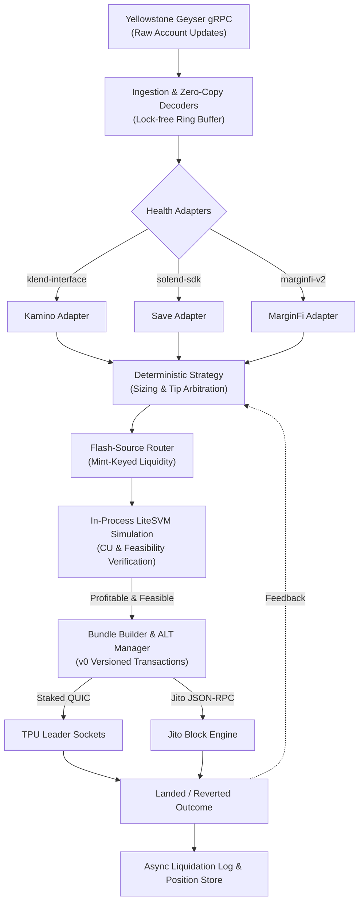

# gyrfalcon

A multi-protocol Solana liquidation engine covering Kamino, Save, and MarginFi.

[](https://github.com/Xtley001/gyrfalcon/actions)
[](./LICENSE)
[](https://www.rust-lang.org)
[](./SECURITY.md)

`gyrfalcon` is an ultra-low-latency liquidation engine engineered for Solana's primary lending markets (**Kamino Lend**, **Save / Solend**, and **MarginFi v2**). It unifies Yellowstone gRPC streaming, in-memory account decoding, zero-risk flash loan routing, in-process LiteSVM transaction simulation, and parallel dual-path submission (Staked QUIC + Jito Block Engine).

## Quickstart

```bash
# Clone and build workspace
git clone https://github.com/Xtley001/gyrfalcon.git
cd gyrfalcon
cargo build --release

# Configure environment
cp config/gyrfalcon.example.toml config/gyrfalcon.toml

# Run in observe mode (zero capital at risk)
cargo run --release -- --config config/gyrfalcon.toml --mode observe
```

## Architecture



## Workspace Crates

| Crate | Path | Responsibility |
|---|---|---|
| `gyrfalcon-core` | `crates/core` | Core domain types, protocol enums, trait interfaces, and 32-byte Pubkey |
| `gyrfalcon-config` | `crates/config` | Strict TOML configuration schemas, risk parameters, and endpoint validation |
| `gyrfalcon-health` | `crates/health` | Protocol obligation decoders and health factor breach calculation |
| `gyrfalcon-ingestion`| `crates/ingestion` | Yellowstone Geyser gRPC streaming client and zero-copy account dispatch |
| `gyrfalcon-router` | `crates/router` | Mint-keyed multi-source flash loan routing and fee evaluation |
| `gyrfalcon-strategy`| `crates/strategy` | Position sizing, dynamic tip bidding, and 4-tier circuit breaker engine |
| `gyrfalcon-sim` | `crates/sim` | LiteSVM in-process simulation harness, replay engine, and CU profiling |
| `gyrfalcon-bundler` | `crates/bundler` | Liquidation/swap instruction building, Token-2022 support, and ALT manager |
| `gyrfalcon-submit` | `crates/submit` | Dual-path submission engine (Staked QUIC + Jito Block Engine bundles) |
| `gyrfalcon-treasury`| `crates/treasury`| Wallet floor monitoring, PnL ledger, and automated profit sweep |
| `gyrfalcon-store` | `crates/store` | In-memory position book and non-blocking asynchronous JSONL logger |
| `gyrfalcon` | `crates/gyrfalcon-bin` | Multi-threaded orchestrator daemon and embedded dashboard server |

## Supported Protocols

| Protocol | Program ID | Mechanism | Flash Loan Support |
|---|---|---|---|
| **Kamino Lend** | `KLend2g3cP87fffoy8q1mQqGKjrxjC8boSyAYavgmjD` | `klend-interface 0.6` | Native Flash Borrow / Repay (`0x87e7...`, `0xb975...`) |
| **Save (Solend)**| `So1endDq2YkqhipRh3WViPa8hdiSpxWy6z3Z6tMCpAo` | `solend-sdk 2.0` | Native Reserve Flash Borrow / Repay (Tags 14 & 15) |
| **MarginFi v2** | `MFv2hWf31Z9kbCa1snEPYctwafyhdvnV7FZnsebVacA` | `marginfi-type-crate`| Native Atomic Flash Borrow / Repay (`0x047e...`, `0x4fd1...`) |

## Supported DEX Venues

| Venue | Program ID | Model | Routing Priority |
|---|---|---|---|
| **Phoenix** | `PhoeNiXZ8ByJGLkxNfZRnkUfjvmuYqLR89jjFHGqdXY` | Crankless On-Chain CLOB | Preferred on high-volume pairs (zero curve slippage) |
| **Raydium CLMM** | `CAMMCzo5YL8w4VFF8KVHrK22GGUsp5VTaW7grrKgrWqK` | Concentrated Liquidity AMM | Direct venue with full tick array traversal |
| **Raydium CPMM** | `CPMMoo8L3F4NbTegBCKVNunggL7H1ZpdTHKxQB5qKP1C` | Constant Product AMM | Direct venue with pool state vaults |
| **Meteora DLMM** | `LBUZKhRxPF3XUpBCjp4YzTKgLccjZhTSDM9YuVaPwxo` | Dynamic Bin Liquidity | Direct venue with active bin arrays |
| **Orca Whirlpools**| `whirLbMiicVdio4qvUfM5KAg6Ct8VwpYzGff3uctyCc` | Concentrated Liquidity AMM | Direct venue with tick arrays and oracle |
| **Jupiter v6** | `JUP6LkbZbjS1jKKwapdHNy74zcZ3tLUZoi5QNyVTaV4` | Meta-Aggregator | Safe fallback when direct pools lack sufficient depth |

## Testing & Verification

The test suite covers unit, failure-injection, and end-to-end integration tests across all 12 workspace crates:

```bash
# Run the complete test suite (130 tests, 100% passing)
cargo test --workspace

# Run historical liquidation replay verification
cargo run --bin replay -- --events tests/fixtures/liquidations.jsonl

# Run production readiness audit
cargo run --bin readiness-check
```

See [bugs.md](./bugs.md) for the complete 50-bug system audit and remediation details.

## Security

Report suspected vulnerabilities according to our [Security Policy](./SECURITY.md). Test all integrations thoroughly in observe mode before deploying live capital.

## Contributing

See [CONTRIBUTING.md](./CONTRIBUTING.md) for contribution guidelines, development setup, and code standards.

## License

Licensed under the [MIT License](./LICENSE).
