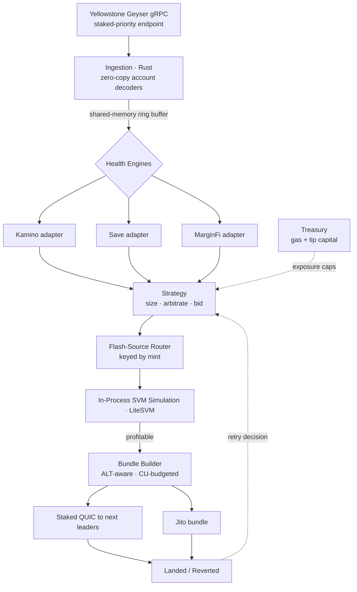

# gyrfalcon

A multi-protocol Solana liquidation bot covering Kamino, Save, and MarginFi from a single latency-optimized engine.

[](https://github.com/Xtley001/gyrfalcon/actions)
[](./LICENSE)
[](https://www.rust-lang.org)
[](./SECURITY.md)

`gyrfalcon` detects health-factor breaches across the three largest Solana lending markets and lands liquidation transactions as close to the network's physical latency floor as possible. It runs one shared engine — Geyser ingestion, in-memory health book, flash-source router, and in-process SVM simulation — with thin per-protocol adapters, so covering a third protocol costs almost nothing once the first is running. This is a liquidation system, not an arbitrage system: the edge is detection speed and submission speed, not pricing cleverness. For the full design rationale and formal profitability model, see the [whitepaper](./docs/whitepaper.md).

> This code has not been audited. Do not commit real liquidation capital without your own review and the [production readiness checklist](./docs/RUNBOOK.md#production-readiness-checklist). `dashboard.html` is a disconnected UI reference — it renders explicit empty states, not example data; see [`docs/DATA_POLICY.md`](./docs/DATA_POLICY.md).

## Table of Contents

- [Architecture](#architecture)
- [Requirements](#requirements)
- [Installation](#installation)
- [Configuration](#configuration)
- [Running](#running)
- [Testing](#testing)
- [Documentation](#documentation)
- [Security](#security)
- [Contributing](#contributing)
- [License](#license)

## Architecture



The `strategy → router → simulator → bundler` path is in-process function calls, not IPC — at microsecond scale a process boundary adds jitter you cannot recover. Adapters are isolated so a panic in one protocol never takes the others down. Flash-borrowed principal is never at risk; the treasury only funds gas, priority fees, and tips, and is capped per transaction and per slot. Full component detail lives in [`docs/ARCHITECTURE.md`](./docs/ARCHITECTURE.md); the decision logic behind sizing, bidding, and capital limits lives in [`docs/STRATEGY.md`](./docs/STRATEGY.md).

## Requirements

- Rust 1.79+ (`stable`)
- A leased Yellowstone Geyser gRPC subscription
- A leased staked-send `sendTransaction` endpoint
- Access to a Jito block-engine region

## Installation

```bash
git clone https://github.com/Xtley001/gyrfalcon.git
cd gyrfalcon
cargo build --release
```

## Configuration

Copy the example config and fill in your leased endpoints and keypair path.

```bash
cp config/gyrfalcon.example.toml config/gyrfalcon.toml
```

Every field is documented in [`docs/CONFIGURATION.md`](./docs/CONFIGURATION.md). Endpoints, per-protocol toggles, and submission regions are set there.

## Running

```bash
# Phase 0 — correctness only, cloud VM, no colocation
cargo run --release -- --config config/gyrfalcon.toml --mode observe

# Phase 1 — production, arms submission
cargo run --release -- --config config/gyrfalcon.toml --mode live
```

`observe` mode runs the full detect → route → simulate path and logs would-be liquidations without submitting. Promote to `live` only after backtests confirm the adapters predict real liquidations on time. See the [runbook](./docs/RUNBOOK.md).

## Testing

```bash
cargo test --workspace
```

Historical-replay and per-route CU profiling harnesses are documented in [`docs/TESTING.md`](./docs/TESTING.md).

## Documentation

| Document | Contents |
|---|---|
| [`docs/BUILD_ORDER.md`](./docs/BUILD_ORDER.md) | Start here to implement — the staged build sequence and exit criteria |
| [`docs/DATA_POLICY.md`](./docs/DATA_POLICY.md) | Hard rule: no mock or synthetic data on any surface, ever |
| [`docs/ARCHITECTURE.md`](./docs/ARCHITECTURE.md) | Component design, data flow, fault isolation |
| [`docs/STRATEGY.md`](./docs/STRATEGY.md) | Sizing, tip bidding, treasury caps, circuit breakers |
| [`docs/API.md`](./docs/API.md) | Backend module contracts, trait definitions, data model |
| [`docs/whitepaper.md`](./docs/whitepaper.md) | Liquidation mechanics, profitability model, invariants |
| [`docs/FEATURES.md`](./docs/FEATURES.md) | What's specified, roadmap, explicit non-goals |
| [`docs/CONFIGURATION.md`](./docs/CONFIGURATION.md) | Every config field and endpoint |
| [`docs/RUNBOOK.md`](./docs/RUNBOOK.md) | Deployment phases, kill switch, cost model, readiness checklist |
| [`docs/TESTING.md`](./docs/TESTING.md) | Replay harness, CU profiling, devnet dry-runs |
| [`CHANGELOG.md`](./CHANGELOG.md) | Version history |

## Security

The single point of failure is the LiteSVM account-sync pipeline; staleness detection and per-adapter halting are mandatory before live capital. Report vulnerabilities per our [security policy](./SECURITY.md). Never inline private keys in config committed to version control.

## Contributing

See [CONTRIBUTING.md](./CONTRIBUTING.md) for dev setup, adapter conventions, and PR guidelines.

## License

Released under the [MIT License](./LICENSE).
