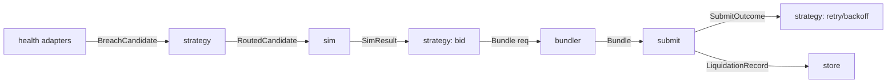

# Backend Reference

The interface contract for every crate in `crates/`. This is the source of truth for module boundaries — if an implementation and this document disagree, this document wins until it is updated in the same PR (see [`CONTRIBUTING.md`](../CONTRIBUTING.md)).

## Table of Contents

- [Module map](#module-map)
- [Core data types](#core-data-types)
- [Trait contracts](#trait-contracts)
- [Internal event bus](#internal-event-bus)
- [State store](#state-store)
- [Scheduler](#scheduler)

## Module map

| Crate | Owns | Does not own |
|---|---|---|
| `ingestion` | Geyser subscription, account decoding, ring-buffer publish | Health computation |
| `health` | Position book per protocol, health-factor recompute, candidate emission | Routing, sizing beyond close-factor lookup |
| `router` | Mint-keyed flash-source selection | Health computation, tip bidding |
| `strategy` | Sizing, arbitration, tip bidding, treasury checks (implements `docs/STRATEGY.md`) | Simulation, submission |
| `sim` | LiteSVM harness, account-sync pipeline | Bidding, submission |
| `bundler` | v0 tx assembly, ALT lookup, CU budgeting | Sizing, bidding |
| `submit` | Staked QUIC send, Jito bundle send, land/revert observation | Retry decisions (returned to `strategy`) |
| `treasury` | Hot wallet balance, sweep, exposure accounting | Signing keys for liquidation principal (none exist — flash-borrowed) |
| `store` | Position-book snapshots, liquidation log, PnL history | Business logic |

## Core data types

```rust
/// Emitted by a health adapter when a position crosses its threshold.
struct BreachCandidate {
    protocol: Protocol,           // Kamino | Save | MarginFi
    position_id: Pubkey,
    collateral_mint: Pubkey,
    debt_mint: Pubkey,
    health_factor: f64,           // < 1.0
    close_factor_max_repay: u64,  // protocol-enforced ceiling, base units
    slot: u64,
}

/// After strategy::size_and_route
struct RoutedCandidate {
    candidate: BreachCandidate,
    repay_amount: u64,            // <= close_factor_max_repay, per docs/STRATEGY.md sizing
    flash_source: FlashSource,    // Kamino | Save | MarginFi reserve pubkey
    expected: ProfitEstimate,     // Π components, pre-simulation
}

struct ProfitEstimate {
    bonus_usd: f64,
    est_slippage_usd: f64,
    flash_fee_usd: f64,
    est_cu_cost_usd: f64,
    bid_tip_usd: f64,
    net_usd: f64,                 // Whitepaper Eq. 2
}

/// After sim::simulate
struct SimResult {
    routed: RoutedCandidate,
    feasible: bool,                // Eqs 4-6 all hold
    cu_measured: u32,
    tx_bytes: usize,
    profitable: bool,              // net_usd > risk.min_profit_usd, re-checked post-sim
}

/// After bundler::build
struct Bundle {
    sim: SimResult,
    versioned_tx: Vec<u8>,        // serialized VersionedTransaction bytes across crate boundaries
    alt_keys: Vec<Pubkey>,
}

/// After submit::send
enum SubmitOutcome {
    Landed { slot: u64, actual_net_usd: f64 },
    Reverted { reason: RevertReason },
    NotIncluded,                   // neither path included it before the position was resolved elsewhere
}

/// Persisted to store on every terminal outcome.
struct LiquidationRecord {
    routed: RoutedCandidate,
    outcome: SubmitOutcome,
    submitted_at_slot: u64,
    resolved_at_slot: u64,
}
```

## Trait contracts

Every protocol adapter implements the same trait so the shared framework never special-cases a protocol by name outside its own adapter module.

```rust
trait HealthAdapter {
    /// Decode one account update; return a candidate iff it now breaches.
    fn on_account_update(&mut self, update: AccountUpdate) -> Option<BreachCandidate>;

    /// Protocol-specific close factor for a given position.
    fn close_factor(&self, position_id: Pubkey) -> u64;

    /// Current count of tracked positions, for the dashboard / stat band.
    fn position_count(&self) -> usize;

    /// Slots since this adapter's account-sync pipeline last confirmed current.
    fn sync_lag_slots(&self) -> u64;
}

trait FlashSourceRouter {
    /// Whitepaper Eq. 3 — select a source reserve for a given mint and amount.
    fn route(&self, mint: Pubkey, amount: u64) -> Option<FlashSource>;
}

trait Simulator {
    /// Runs the candidate against a slot-current account set. Never mutates real state.
    fn simulate(&self, routed: RoutedCandidate) -> SimResult;
}

trait Submitter {
    /// Fires both paths in parallel; returns once either resolves or a timeout elapses.
    async fn submit(&self, bundle: Bundle) -> SubmitOutcome;
}
```

`strategy` is not a trait — it is one deterministic module (`crates/strategy`) implementing sizing, arbitration, tip bidding, and treasury checks exactly as specified in [`STRATEGY.md`](./STRATEGY.md), since the whole point of consolidating decision logic is that it is not protocol-specific and does not need per-protocol overrides.

## Internal event bus

Everything downstream of ingestion communicates over typed, bounded channels within one process — never a generic queue, never IPC (see [`ARCHITECTURE.md`](./ARCHITECTURE.md#hard-constraints)).



Strategy appears three times in the flow because sizing/routing, bidding, and retry/backoff are the same module invoked at different pipeline stages — not three separate services.

## State store

An embedded, single-process store (not a networked database — it would sit on the hot path otherwise). Two tables:

| Table | Contents | Write pattern |
|---|---|---|
| `position_book` | Latest known state per tracked position, per protocol | Overwritten on every account update; periodically snapshotted to disk for restart recovery |
| `liquidation_log` | Append-only `LiquidationRecord` per terminal outcome | Append-only; source of truth for the dashboard's PnL history and the drawdown circuit breaker |

The position book is authoritative in memory — the on-disk snapshot exists only to avoid a cold re-sync from genesis-of-subscription on restart, not as a source of truth during normal operation.

`liquidation_log` is the input to the drawdown circuit breaker and the dashboard's PnL history, but it is an internal append-only log, not an accounting artifact. A separate export function (`store::export_liquidation_log(range) -> CSV | JSON`) is the intended path to your own bookkeeping — build it against this schema rather than parsing dashboard output, since the dashboard is a visual reference, not a data API (see [`FEATURES.md`](./FEATURES.md)).

## Scheduler

The per-slot arbitration described in [`STRATEGY.md`](./STRATEGY.md#multi-candidate-arbitration) is implemented as a bounded priority queue inside `strategy`, keyed by net EV, re-drained every slot boundary. It is not a cron-style batch job — a new high-EV candidate can preempt the queue immediately.
