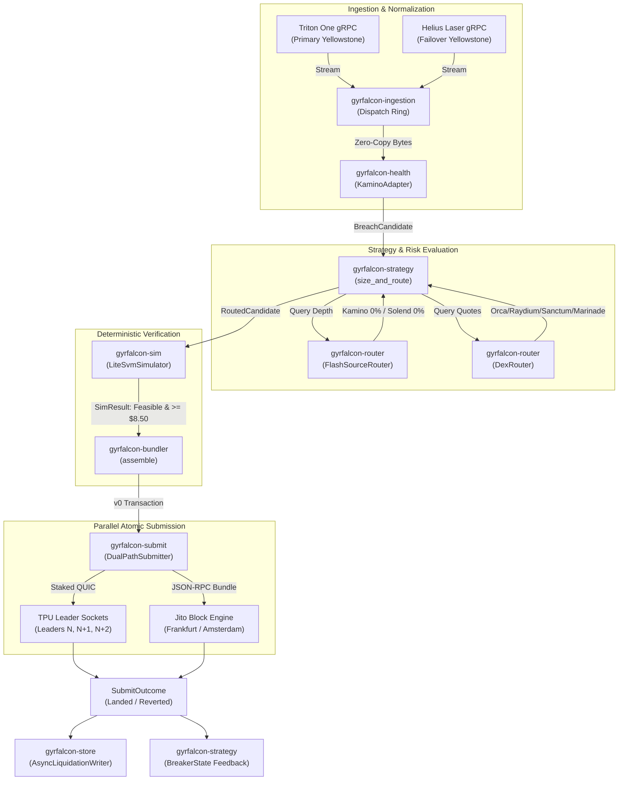
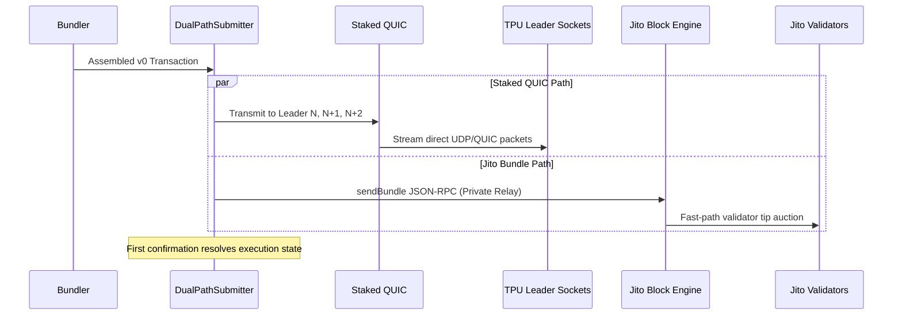

# System Execution Architecture

Deep system architecture, pipeline specifications, and runtime topology for `gyrfalcon`.

## System Overview

`gyrfalcon` is organized as a modular 12-crate Rust workspace on Solana, targeting Kamino Lend liquidations. The critical execution path is entirely in-process, non-blocking, and zero-allocation.



## Nine-Stage Execution Pipeline

```
1. INGEST     -> Yellowstone Geyser gRPC sub-block account stream (crates/ingestion)
2. DECODE     -> Zero-copy binary parser in KaminoAdapter (crates/health)
3. BREACH     -> Health factor breach detection emitting BreachCandidate when HF < 1.0
4. SIZE/ROUTE -> Constrained position sizing, flash source selection, DEX route arbitration
5. SIMULATE   -> In-process deterministic execution via LiteSVM (crates/sim)
6. BUNDLE     -> v0 VersionedTransaction assembly with ALT compaction (crates/bundler)
7. SUBMIT     -> Parallel race: Staked QUIC leaders vs Jito Block Engine (crates/submit)
8. RESOLVE    -> Terminal outcome classification (Landed, Reverted, Dropped)
9. PERSIST    -> Asynchronous non-blocking audit logging & breaker update (crates/store)
```

## Workspace Crate Topology

```
crates/
├── core/             # Canonical domain types, Protocol enum, trait abstractions, Pubkey
├── config/           # TOML configuration parser, environment validator, and schema
├── health/           # Kamino obligation/reserve decoders and health factor calculator
├── ingestion/        # Yellowstone gRPC client with automatic failover and reconnect
├── router/           # Multi-source flash loan router and 4-venue direct DEX router
├── strategy/         # Sizing engine, dynamic congestion tip curves, and circuit breakers
├── sim/              # In-process LiteSVM simulation harness and historical replay tool
├── bundler/          # Instruction builders (Kamino liquidation, swaps, flash repay, ALT)
├── submit/           # Parallel transport: Staked QUIC leader sockets and Jito bundles
├── treasury/         # Realized PnL ledger, wallet floor monitoring, profit sweep
├── store/            # Non-blocking mpsc JSONL liquidation auditor and position cache
└── gyrfalcon-bin/    # Orchestrator daemon runtime and embedded Axum dashboard server
```

## Connectivity Verification Layer

A background heartbeat thread validates connectivity and market sanity every 30 seconds. A failure in any check blocks liquidation arming for the affected route:

| Subsystem | Verified Invariant | Failure Action |
|---|---|---|
| **Yellowstone gRPC** | Stream ping latency < 50 ms and zero dropped slots | Failover from Triton to Helius stream |
| **Kamino Bytecode** | Program bytecode hash equals pinned Anchor release hash | Emergency halt of daemon process |
| **Pyth Price Feeds** | Price update timestamp is within 1s heartbeat | Halt trading on affected collateral/debt market |
| **Oracle vs Spot** | Pyth price vs DEX spot divergence < 1.00% | Halt trading on affected pair (de-peg alert) |
| **Flash Liquidity** | Kamino reserve idle liquidity $\ge$ target clip | Route to Solend fallback flash loan |
| **DEX Liquidity** | Target DEX pool TVL accommodates trade within slippage budget | Down-size clip or reject candidate |
| **Signer Balance** | Executor wallet SOL balance $\ge$ `risk.treasury_floor_sol` | Halt trading, alert operator for refill |
| **Jito Relay** | At least one regional block engine endpoint active | Failover to next regional endpoint |

## In-Process LiteSVM Simulation Harness

Unlike EVM searchers who rely on RPC node forks or local Anvil instances, `gyrfalcon` embeds the `LiteSvm` runtime directly into the execution process.

### Simulation Invariants

1. **Deterministic Execution**: The candidate transaction is executed against the in-memory slot bank. Any instruction error (e.g. `Custom(6000)` Kamino error codes) triggers an immediate discard.
2. **Compute Budget Validation**: Measured compute unit consumption must not exceed 1,400,000 CU.
3. **Absolute Hurdle Floor**: Net signer profit after simulated swap slippage, flash-loan fees, and priority fees must satisfy:
   $$\text{NetProfit}_{\text{sim}} \ge \$8.50 \text{ USD}$$
4. **Oracle Slot Synchronization**: Simulation fails if the bank's clock slot diverges from the latest Pyth oracle update slot.

## Submission Layer: Dual-Path Transport

To avoid public mempool visibility and maximize landing speed, `gyrfalcon` bypasses standard RPC `sendTransaction` endpoints entirely:



### Bundle Atomicity Guarantees

All operations are encapsulated in a single Solana transaction containing:
1. Instruction 0: Flash Borrow (Kamino or Solend)
2. Instruction 1: Set Compute Unit Limit & Price
3. Instruction 2: Kamino `liquidateObligationAndRedeemReserveCollateral`
4. Instruction 3: DEX Swap (Orca, Raydium, Sanctum, or Marinade)
5. Instruction 4: Flash Repay
6. Instruction 5: Jito Tip Transfer (if Jito route selected)

Because Solana enforces transaction atomicity, if the seized collateral swap generates insufficient proceeds to repay the flash loan, the entire transaction reverts. Principal capital cannot be lost.

## Circuit Breakers & Risk Engine

The risk engine in `gyrfalcon-strategy` evaluates four discrete failure conditions:

| Breaker Trigger | Condition | Recovery Action |
|---|---|---|
| `ConsecutiveRevert` | $\ge 3$ consecutive on-chain reverts on a route | Lock out specific route for 300 slots |
| `SyncLag` | Ingestion stream lag $> 5$ slots | Halt trading until stream catches up to slot tip |
| `TreasuryFloor` | Wallet balance $< 1.0$ SOL | Complete halt until manual wallet replenishment |
| `Drawdown` | Cumulative rolling losses exceed configured ceiling | Trip system-wide killswitch |
