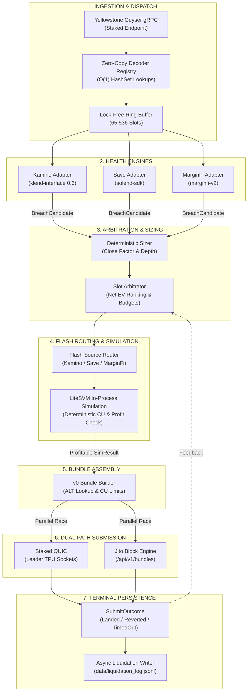
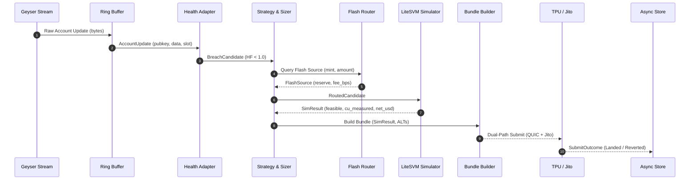
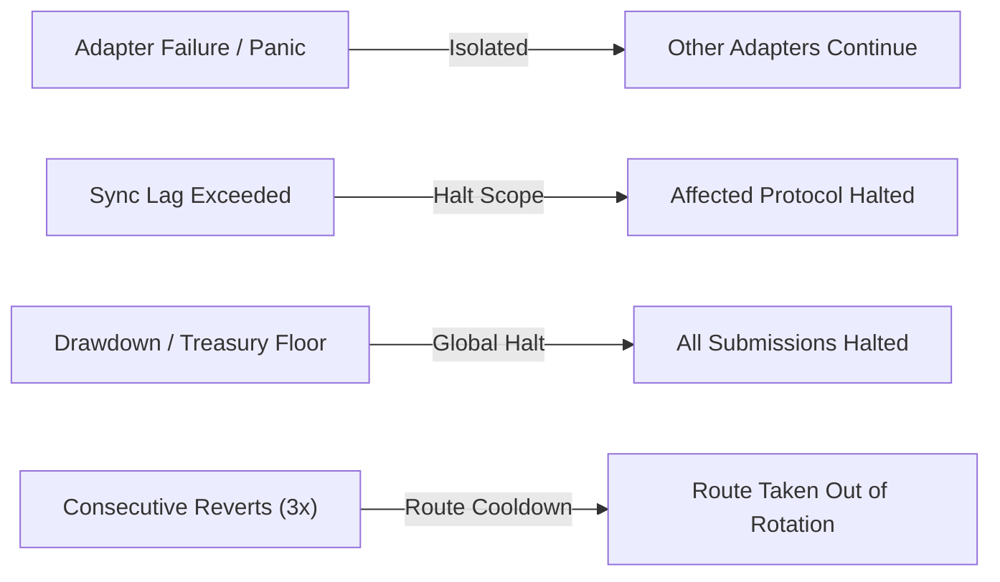

# System Architecture

This document specifies the technical design, sub-millisecond execution pipeline, and fault-isolation boundaries of the `gyrfalcon` multi-protocol liquidation engine.

## Table of Contents

- [System Overview](#system-overview)
- [Pipeline Flow & Data Path](#pipeline-flow--data-path)
- [Ingestion Layer](#ingestion-layer)
- [Health Engines & Protocol Adapters](#health-engines--protocol-adapters)
- [Strategy Arbitration & Position Sizing](#strategy-arbitration--position-sizing)
- [Mint-Keyed Flash Source Router](#mint-keyed-flash-source-router)
- [In-Process LiteSVM Simulation](#in-process-litesvm-simulation)
- [Transaction Bundler & ALT Manager](#transaction-bundler--alt-manager)
- [Dual-Path Submission Transports](#dual-path-submission-transports)
- [Treasury & Capital Float Management](#treasury--capital-float-management)
- [Embedded State Store](#embedded-state-store)
- [Hard Operational Constraints](#hard-operational-constraints)
- [Fault Isolation & Circuit Breakers](#fault-isolation--circuit-breakers)
- [Workspace Crate Layout](#workspace-crate-layout)

---

## System Overview



The entire execution hot path (`Ingestion → Health → Strategy → Routing → Simulation → Bundling`) operates strictly in-process through non-allocating method calls and lock-free channels. Microsecond execution prohibits inter-process communication (IPC) or remote network RPC round trips on the hot path.

---

## Pipeline Flow & Data Path



---

## Ingestion Layer

The ingestion layer (`crates/ingestion`) ingests raw account data from a Yellowstone Geyser gRPC subscription:

- **Zero-Copy Account Casting**: `bytemuck`-backed unaligned deserialization for fixed-size memory layouts.
- **Lock-Free Ring Buffer**: A crossbeam circular buffer passing `AccountUpdate` records without runtime memory allocation.
- **Fast Discriminator Verification**: Constant-time owner matching and account length verification before downstream dispatch.

---

## Health Engines & Protocol Adapters

Each protocol is implemented as an isolated `HealthAdapter` (`crates/health`):

- **Kamino Lend (`klend`)**: Obligation decoding with multi-collateral and multi-debt evaluation, dynamic close factor computation, and timestamp-based oracle staleness checks.
- **Save (Solend)**: Obligation unpack with reserve configuration decoding and slot-based staleness evaluation.
- **MarginFi v2**: Lending account parsing with bank share-to-asset liability conversion, multi-bank health checks, and oracle staleness validation.

---

## Strategy Arbitration & Position Sizing

The strategy engine (`crates/strategy`) computes deterministic decisions across candidate breaches:

- **Position Sizing**: Sized to the minimum of protocol close-factor ceiling, available flash-loan liquidity, and remaining slot budget.
- **Profit Equation**: Evaluates gross liquidation bonus minus slippage, flash-loan fees, compute unit execution costs, and dynamic tip bids.
- **Arbitration**: Resolves simultaneous candidate collisions within a single slot by expected net profit ($EV$).

---

## Mint-Keyed Flash Source Router

The flash-source router (`crates/router`) routes liquidity independently of the protocol being liquidated:

| Source | Flash Mechanism | Characteristics |
|---|---|---|
| **Kamino Lend** | Native instruction introspection | Deepest SOL and major stablecoin pools |
| **Save (Solend)** | `flashBorrowReserveLiquidity` / `flashRepayReserveLiquidity` | Proven production pattern since 2021 |
| **MarginFi v2** | `lending_account_start_flashloan` / `end_flashloan` | Native account-level flash loans |

Selection ranks candidates by depth, fee basis points, and historical write-lock contention.

---

## In-Process LiteSVM Simulation

Every candidate is verified in-process using **LiteSVM** (`crates/sim`):

- **Zero-Network Simulation**: Executes transactions in-memory against a cloned account state in microseconds.
- **Accurate Compute Budgeting**: Reads exact compute units consumed to set tight `setComputeUnitLimit` parameters.
- **Post-Sim Validation**: Re-confirms `net_profit_usd > risk.min_profit_usd` before transmission.

---

## Transaction Bundler & ALT Manager

Assembles v0 versioned transactions under strict Solana limits (`crates/bundler`):

- **Address Lookup Table (ALT) Manager**: Creates, extends, and caches ALTs for frequently liquidated mint and reserve pairs.
- **Direct DEX Routing**: Pre-constructed swap instructions for **Raydium CLMM**, **Orca Whirlpools**, and **Meteora DLMM**.
- **Token-2022 Support**: Computes transfer fees for Token Extensions tokens.

---

## Dual-Path Submission Transports

Parallel dual-path execution (`crates/submit`):

- **Staked QUIC Send**: Direct transmission to the current and scheduled leader validator TPU sockets.
- **Jito Block Engine**: Parallel bundle submission to Jito Block Engine endpoints (`/api/v1/bundles`).
- **First-To-Resolve Race**: Non-blocking cancellation of the slower path once confirmation or reversion resolves.

---

## Treasury & Capital Float Management

The treasury module (`crates/treasury`) protects operating float:

- Flash-loan principal is never exposed to loss (repaid atomically in the same transaction).
- Capital exposure is restricted to gas, priority fees, and tip bids.
- Automated sweeps transfer accumulated profits back to cold treasury wallets.

---

## Embedded State Store

Single-process, non-blocking storage (`crates/store`):

- **Position Book**: In-memory position registry with snapshotting for restart recovery.
- **Async Liquidation Log**: Bounded mpsc channel writing JSONL audit trails to `data/liquidation_log.jsonl` without stalling execution.

---

## Hard Operational Constraints

| Constraint | Limit | Consequence of Violation |
|---|---|---|
| **Transaction Size** | 1232 bytes | Dropped by network; requires v0 message + warmed ALTs |
| **Compute Units** | Route Profiled (max 1.4M) | Under-request fails transaction mid-execution |
| **CPI Depth** | 4 nested invocations | Exceeding limit aborts atomic swap |
| **Write-Lock Contention** | Reserve / Account level | Contended accounts queue behind competing transactions |

---

## Fault Isolation & Circuit Breakers



Four distinct circuit breakers protect capital:
1. **Consecutive Revert Breaker**: Halts a specific route after repeated reverts.
2. **Treasury Floor Breaker**: Halts submission if operating SOL float falls below configured minimums.
3. **Drawdown Breaker**: Halts submission if rolling losses exceed maximum drawdown limits.
4. **Sync Lag Breaker**: Halts individual protocol adapters if slot lag exceeds threshold.

---

## Workspace Crate Layout

```
gyrfalcon/
├── crates/
│   ├── core/            # Domain types, traits, protocol enums, Pubkey
│   ├── config/          # TOML configuration parser and risk schemas
│   ├── ingestion/       # Yellowstone gRPC client, ring buffer, decoder registry
│   ├── health/          # HealthAdapter trait & Kamino/Save/MarginFi adapters
│   ├── strategy/        # Position sizing, dynamic tip bidding, circuit breakers
│   ├── router/          # Multi-source flash-loan router
│   ├── sim/             # LiteSVM simulator, replay harness, CU profiling
│   ├── bundler/         # v0 transaction assembly, DEX swaps, ALT manager
│   ├── submit/          # Dual-path submitter (Staked QUIC + Jito)
│   ├── treasury/        # Treasury balance tracking and profit sweep
│   ├── store/           # Position book and async liquidation logger
│   └── gyrfalcon-bin/   # Orchestrator daemon & dashboard WebSocket server
├── config/              # gyrfalcon.example.toml, gyrfalcon.devnet.toml
├── deploy/              # Dockerfile and systemd service units
├── docs/                # Architecture, whitepaper, strategy, and testing specs
└── tests/fixtures/      # Historical liquidation fixtures and CU tables
```
