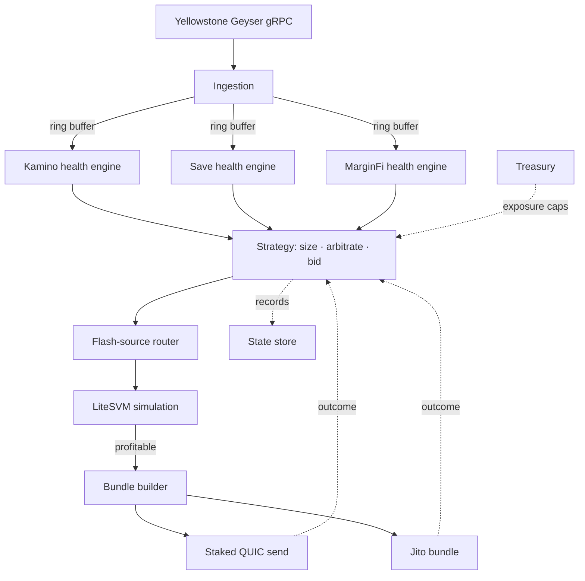

# Architecture

Deep design reference for `gyrfalcon`. The README carries the high-level flow; this document covers each component, the constraints it operates under, and why the boundaries fall where they do.

## Table of Contents

- [System overview](#system-overview)
- [Ingestion](#ingestion)
- [Health engines](#health-engines)
- [Strategy layer](#strategy-layer)
- [Flash-source router](#flash-source-router)
- [Simulation](#simulation)
- [Bundle builder](#bundle-builder)
- [Submission path](#submission-path)
- [Treasury](#treasury)
- [State store](#state-store)
- [Hard constraints](#hard-constraints)
- [Fault isolation](#fault-isolation)
- [Directory layout](#directory-layout)

## System overview



Everything from the strategy layer onward runs as in-process function calls inside one binary. The split into "separate concerns" is about fault isolation and code organization, not process separation — once decisions reach microsecond scale, crossing a process boundary introduces jitter that cannot be recovered. Full trait-level contracts for every module are in [`API.md`](./API.md); the decision policy each module executes is in [`STRATEGY.md`](./STRATEGY.md).

## Ingestion

The ingestion layer subscribes to a leased Yellowstone Geyser gRPC endpoint and decodes account updates for every watched program.

- **Per-protocol decoders** — raw Borsh structs generated directly from each protocol's IDL, not routed through a high-level client's async deserialization path.
- **Zero-copy casts** — `bytemuck`-style casts wherever the account layout allows fixed-size, `#[repr(C)]`-safe structs.
- **Shared-memory ring buffer** — decoded updates are handed to the health engines through a lock-free ring buffer, keeping the hot path off the allocator.

A stale layout produces silently wrong health-factor numbers rather than a visible crash, so decoders are pinned to the deployed program's current IDL and re-verified on every protocol upgrade.

## Health engines

Each protocol has its own adapter maintaining an in-memory position book. On every relevant account event the adapter recomputes the affected position's health factor and, if it breaches, emits a candidate.

The three protocols share one liquidation mechanic in shape — health-factor breach, seize collateral at a protocol-fixed discount — so a single health-engine framework is templated across all three with protocol-specific adapters rather than three unrelated codebases. Differences that adapters must encode individually:

- **Oracle sourcing and staleness/confidence handling** — each protocol may validate price feeds slightly differently; a shared decoder assuming one behavior misfires on the one that differs.
- **Health-factor formula specifics** — LTV tiers, liquidation thresholds, and close factors are protocol-defined.
- **Isolated vs. main markets** — Kamino's newer isolated markets and MarginFi's smaller pools carry materially less bot coverage than Save's older, heavily-covered markets.

## Strategy layer

The strategy module is invoked at three points in the pipeline — sizing/routing input, tip bidding after simulation, and retry/backoff after a submission outcome — but it is one deterministic module, not three services (see [`API.md`](./API.md#internal-event-bus)). It is the only place protocol-agnostic decision logic lives; adapters emit breaches, strategy decides what to do about them.

- **Sizing** — repays the maximum the protocol's close factor allows, stepped down only for flash-source depth, route feasibility, or treasury caps.
- **Arbitration** — when multiple net-positive candidates compete in one slot, ranks by net EV, defers reserve conflicts, and enforces the per-slot treasury budget.
- **Bidding** — sets the tip from a contention-driven curve, bounded by a hard ceiling expressed as a share of the bonus itself.

Full policy detail, including the exact bidding formula and circuit-breaker table, is in [`STRATEGY.md`](./STRATEGY.md).

## Flash-source router

There is no single flash-loan provider. The router is keyed by mint and is completely independent of which protocol is being liquidated.

| Source | Flash mechanism | Notes |
|---|---|---|
| Kamino (kLend) | Native flash-borrow / flash-repay, enforced by instruction introspection | Deepest reserves for SOL/USDC and major stables; typically cheapest fee — confirm current bps live |
| Save (Solend) | `flashBorrowReserveLiquidity` / `flashRepayReserveLiquidity` | Original Solana flash-loan pattern, in production since 2021 |
| MarginFi | `lending_account_start_flashloan` / `lending_account_end_flashloan` | Native flash-loan support enabled via account-level `ACCOUNT_IN_FLASHLOAN` flag |

The router ranks across all three sources (Kamino, Save, and MarginFi), comparing fee schedules and real-time available liquidity.

Router selection, given a mint and amount, ranks candidate reserves by:

- **Depth** — sufficient available liquidity for this mint at this size right now, not headline TVL.
- **Fee** — lower bps wins when both sources have sufficient depth.
- **Contention risk** — whether the reserve account is likely to be write-locked by other activity this slot.

## Simulation

Profitability is confirmed with **LiteSVM** — an in-process Rust SVM implementation with no validator process and no RPC round trip, executing against a supplied account set at microsecond scale, called directly as a library.

The hard part is not the call; it is keeping the simulated account set current. A continuous account-cloning pipeline runs off the Geyser stream — reserves, oracle accounts, and obligation/position accounts for every candidate — feeding LiteSVM's account store and kept current to the slot.

> If this pipeline drifts stale, every downstream decision — profitability, sizing, CU budget — is computed against a world that no longer exists. This is the system's single point of failure. Staleness detection is mandatory, and sync lag past threshold halts the affected adapter, not the whole system.

## Bundle builder

Builds the final transaction under two hard, binary constraints (see [Hard constraints](#hard-constraints)):

- Versioned (v0) transactions by default.
- Address Lookup Tables precomputed and warmed per route ahead of time.
- `setComputeUnitLimit` set tightly per route from real profiling data.
- Direct, pre-computed swap routes against specific AMM programs — not a live aggregator call on the hot path.

## Submission path

Dual-path in production, because the two paths fail differently:

- **Staked QUIC send** to the current and next couple of leaders, using the public leader schedule (known ahead of time, not discovered reactively).
- **Jito bundle** in parallel, for atomic ordering relative to the bot's own instruction set.

Validator TPU connections prioritize staked identities. An RPC-only node with no vote and no stake queues alongside every other unstaked bot. The pragmatic starting point is a leased staked-send endpoint; running an actual staked validator is gated on production data showing races lost specifically to staked-QoS priority.

## Treasury

Flash-borrowed liquidation principal is never at risk (repaid atomically within the same transaction). The treasury module holds and accounts for the capital that *is* at risk — gas, priority fees, and Jito tips — and enforces the exposure caps that gate the strategy layer's bidding decisions: a minimum balance floor, a per-transaction tip ceiling, and a per-slot tip budget. Realized profit is swept back to the treasury on a schedule rather than accumulating in the settlement wallet. Full policy in [`STRATEGY.md`](./STRATEGY.md#treasury-and-capital-management).

## State store

An embedded, single-process store — not a networked database, which would sit on the hot path. Two tables: an overwritten `position_book` snapshotted periodically for restart recovery, and an append-only `liquidation_log` that is the source of truth for PnL history, the drawdown circuit breaker, and the dashboard. Schema and write pattern in [`API.md`](./API.md#state-store).

## Hard constraints

These are binary — a route either fits or does not exist. There is no graceful degradation.

| Constraint | Limit | Consequence of violating |
|---|---|---|
| Transaction size | 1232 bytes | Route cannot be submitted; requires v0 tx + warmed ALTs |
| Compute units | 200k default, 1.4M block cap | Under-request kills the tx mid-execution — an expensive partial failure |

The 200k figure is the Solana runtime's default `setComputeUnitLimit` if a transaction requests none — it is background context, not a value `gyrfalcon` relies on. Every route ships with its own profiled limit from real LiteSVM runs (see [Bundle builder](#bundle-builder) and [`docs/TESTING.md`](./TESTING.md#per-route-cu-profiling)); the 200k default is never the operative number for a submitted transaction. The 1.4M figure is the whole block's aggregate cap, not a per-transaction target.
| CPI depth | Capped | Full-aggregator swap routing risks hitting the ceiling on multi-hop trades |
| Write-lock contention | Per-reserve, per-slot | Hot reserves get write-locked by every competing bot; not derivable from TVL |

Per-route CU consumption is profiled offline through LiteSVM (actual numbers, not estimates) and feeds both `setComputeUnitLimit` and priority-fee bidding math, which is separate from any Jito tip. Associated Token Accounts for every mint across all three protocols are pre-provisioned so no account-creation instruction is added mid-liquidation.

## Fault isolation

- Each protocol adapter is isolated; a panic in one does not take the others down.
- Staleness in the account-sync pipeline halts only the affected protocol's adapter.
- The hot decision path (`strategy → router → simulator → bundler`) stays in-process to avoid IPC jitter.
- A treasury-floor or drawdown breaker halts the whole engine; a sync-lag or consecutive-revert breaker halts only its scope. See [`STRATEGY.md`](./STRATEGY.md#circuit-breakers) for the full breaker table.

## Directory layout

```
gyrfalcon/
├── crates/
│   ├── ingestion/       # Geyser gRPC subscribe + zero-copy decoders
│   ├── health/          # shared health-engine framework
│   │   └── adapters/    # kamino, save, marginfi
│   ├── strategy/        # sizing, arbitration, tip bidding, retry/backoff
│   ├── router/          # mint-keyed flash-source router
│   ├── sim/             # LiteSVM harness + account-sync pipeline
│   ├── bundler/         # v0 tx, ALT management, CU budgeting
│   ├── submit/          # staked QUIC + Jito dual send
│   ├── treasury/        # hot wallet accounting, exposure caps, sweeps
│   └── store/           # position-book snapshots, liquidation log
├── config/              # gyrfalcon.toml + example
├── docs/                # this directory
└── tests/               # historical replay + route profiling
```
