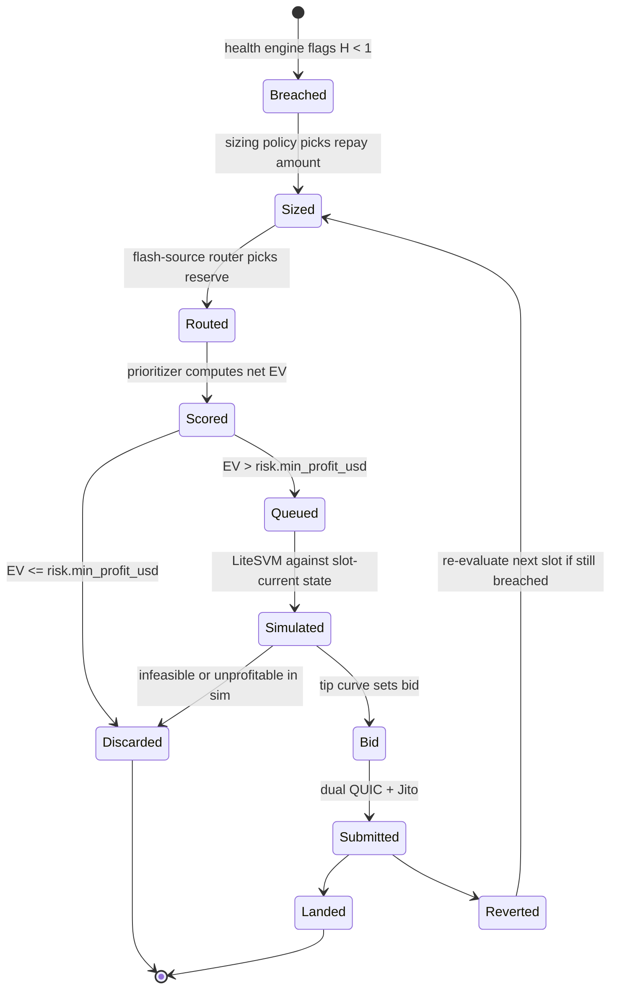

# Strategy

This is the decision layer: given a breached position, what does the engine actually do — how much to repay, how much to bid, which candidate wins when several compete for the same slot, and when to stop trading entirely. Everything here exists to serve one objective:

> Land the maximum risk-adjusted net-profitable liquidation, first, without uncapped capital exposure.

The whitepaper's Equation 2 (`Π = r·b − s − r·f − κ − τ`) says whether a single candidate is worth firing. This document says how the engine behaves when there are many candidates, finite tip budget, and finite slot throughput — the part a formula per-candidate doesn't answer.

## Table of Contents

- [Candidate lifecycle](#candidate-lifecycle)
- [Position sizing](#position-sizing)
- [Multi-candidate arbitration](#multi-candidate-arbitration)
- [Tip bidding model](#tip-bidding-model)
- [Treasury and capital management](#treasury-and-capital-management)
- [Circuit breakers](#circuit-breakers)
- [Retry and backoff](#retry-and-backoff)
- [Cold start](#cold-start)

## Candidate lifecycle



A candidate is re-scored from scratch on every slot it survives — a stale score is never resubmitted as-is.

## Position sizing

Every protocol enforces a close factor: the maximum fraction of a position's debt that can be repaid in one liquidation call. The engine repays the **maximum allowed by the close factor**, not a smaller amount, unless one of the following reduces it:

- **Flash-source depth.** `r` is capped at the depth available on the chosen reserve at that moment (Whitepaper Eq. 3). A partial fill at lower `r` is still evaluated on its own EV — it is not skipped just because it is smaller than the close-factor maximum.
- **Route feasibility.** If the full close-factor amount pushes the swap leg into a route that no longer fits the CU/size ceiling (thin liquidity, more hops), the engine steps `r` down until the route fits or the candidate is discarded.
- **Treasury exposure cap.** See [Treasury](#treasury-and-capital-management) — a single candidate cannot consume more than `risk.max_tip_per_tx_usd` in expected tip regardless of how large the bonus is.

Sizing does not go the other way — the engine never repays less than the close factor allows purely to reduce risk, because the flash-loan principal is never actually at risk (Invariant I5, repay atomicity). The only real capital at risk is the tip and gas spend, which sizing does not change.

## Multi-candidate arbitration

Slot throughput and tip budget are finite even when principal is not. When more than one net-positive candidate is queued in the same evaluation window:

1. **Rank by net EV descending** (Whitepaper Eq. 2), not by bonus size — a large bonus with a large slippage cost can rank below a smaller, cleaner one.
2. **Reserve-conflict check.** Two candidates routed through the same source reserve in the same slot compete for the same write-lock. The lower-EV one is deprioritized to next slot rather than fired alongside a near-certain loser.
3. **Treasury budget check.** Running total of committed tip spend for the current slot is checked against `risk.max_tip_per_slot_usd` (see Configuration). Candidates beyond the budget queue for the next slot instead of firing uncapped.
4. **Fire remaining candidates independently** — each still gets its own transaction and its own dual-path submission; arbitration only decides order and which ones wait, never merges candidates into one transaction.

This is a priority queue re-evaluated every slot, not a batch scheduler — a new breach can jump the queue immediately if its EV clears the current head.

## Tip bidding model

Static tips either overpay in quiet periods or lose races during contention. The bid is a function of the same contention signal the router already tracks per reserve (Whitepaper Eq. 3, `contention_ρ`):

```
tip = clamp(
  floor_tip + k * contention(reserve) * (r * b),
  min = risk.min_tip_usd,
  max = min(risk.max_tip_pct_of_bonus * r * b, risk.max_tip_per_tx_usd)
)
```

- `floor_tip` covers baseline landing probability in uncontended slots.
- The contention multiplier scales up only on reserves with an empirically high write-lock contention rate — the same map built for router depth checks (`docs/RUNBOOK.md`).
- The hard ceiling (`max_tip_pct_of_bonus`) guarantees the tip can never exceed a bounded share of the bonus itself — the engine cannot bid its way into a net-negative trade regardless of contention.
- `k` is recalibrated from landing-rate data (see [Cold start](#cold-start)), not hand-tuned once and left static.

Cascade events (Whitepaper Appendix A) push `contention(reserve)` up sharply, which pushes tips up proportionally — the model does not need special-casing for cascades, it is already contention-driven.

## Treasury and capital management

The flash-loan mechanism means liquidation **principal** is never held by the engine — Invariant I5 guarantees borrow, liquidate, swap, and repay happen atomically or not at all. The capital that *is* actually at risk is smaller but real:

| Capital use | At risk? | Notes |
|---|---|---|
| Liquidation principal (`r`) | No | Flash-borrowed and repaid atomically within the same transaction |
| Gas / base transaction fee | Yes | Paid regardless of landing |
| Priority fee | Yes | Paid regardless of landing |
| Jito tip | Yes, only if bundle lands | Jito tips are only paid on landed bundles, but staked-QUIC priority fees are not refunded on a lost race |

A single hot wallet ("treasury") funds gas, priority fees, and tips. It is **not** used for liquidation principal.

- **Minimum balance.** Below `treasury.min_balance_sol`, the engine stops firing new candidates and alerts — a low treasury should never be discovered by a failed submission.
- **Maximum exposure per slot.** `risk.max_tip_per_slot_usd` bounds total committed spend across every candidate fired in one slot, independent of how many candidates clear individually (see [Multi-candidate arbitration](#multi-candidate-arbitration)).
- **Maximum exposure per transaction.** `risk.max_tip_per_tx_usd` bounds any single candidate regardless of its bonus size.
- **Refill.** Realized profit (net of tips and fees) is swept from the settlement wallet back to the treasury on a schedule (`treasury.sweep_interval`), keeping the hot wallet's balance close to its operating floor rather than accumulating an unnecessarily large hot balance.

## Circuit breakers

Independent of the per-protocol sync-lag halt (Whitepaper Invariant I2, `docs/RUNBOOK.md`), the following stop new submissions:

| Breaker | Trigger | Scope | Reset |
|---|---|---|---|
| Consecutive-revert | N reverts in a row on the same route | That route only | Manual re-arm after root-causing the revert |
| Treasury floor | Balance below `treasury.min_balance_sol` | Whole engine | Automatic once refilled above floor |
| Drawdown | Realized 24h PnL below `risk.max_drawdown_usd` | Whole engine | Manual re-arm |
| Per-protocol sync lag | Sync lag exceeds `risk.sync_lag_halt_slots` | That protocol's adapter only | Automatic once lag clears |

A breaker halting the whole engine is a deliberately higher bar than halting one adapter — protocol-specific problems (bad IDL, one bad oracle) should never take down coverage on the other two protocols (Invariant I4).

## Retry and backoff

A reverted transaction is never blindly resubmitted. On revert:

1. Re-check whether the position is still breached — price may have recovered.
2. If still breached, re-run sizing, routing, and simulation from scratch against the new slot's state — the reason for the revert (stale ALT, lost write-lock race, insufficient CU) is exactly the kind of thing a stale resubmission would repeat.
3. If the same route reverts `N` times consecutively, the consecutive-revert breaker takes it out of rotation (see [Circuit breakers](#circuit-breakers)) rather than retrying indefinitely.

## Cold start

Before `submit.mode = "live"`, the tip curve constant `k` and the per-reserve contention map are calibrated from `observe`-mode data, not assumed. `observe` mode runs the full detect → route → simulate path, records what the engine *would* have bid and whether a competing bot's landed transaction implies it would have won, and uses that to seed `k` and `contention_ρ` before any capital is at risk. Promotion to `live` follows the [production readiness checklist](./RUNBOOK.md#production-readiness-checklist), which now includes treasury funding and breaker verification.
