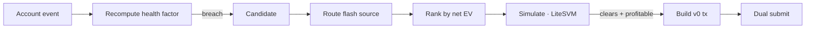

# Gyrfalcon: A Multi-Protocol Solana Liquidation Engine

Version 0.1 (design specification, pre-implementation) · Xtley001

> This paper describes the target design and has not yet been validated against a working implementation. Section 6's invariants are the acceptance criteria the eventual build must satisfy — see [`docs/BUILD_ORDER.md`](./BUILD_ORDER.md) — not a description of code that exists today. It will be re-versioned to v1.0 with a real date once the system passes the [production readiness checklist](./RUNBOOK.md#production-readiness-checklist).

> **Note on math rendering:** GitHub does not render LaTeX in plain `.md`. Equations below use `$...$` / `$$...$$` and are intended for a KaTeX-enabled docs site (GitBook/Docusaurus). On GitHub they display as source; a rendered fallback is planned for the published docs.

## Abstract

Solana lending markets permit any address to repay a portion of an undercollateralized borrower's debt in exchange for seizing collateral at a protocol-fixed discount. This opportunity is winner-take-all and exists only at the instant a position breaches its health-factor threshold, so the profitable actor is the one who both detects the breach first and lands a transaction first. Gyrfalcon covers the three largest Solana lending markets — Kamino, Save, and MarginFi — from one shared latency-optimized engine with thin per-protocol adapters. This paper specifies the liquidation mechanic these protocols share, the net-value model the engine optimizes, the hard on-chain constraints a candidate transaction must satisfy, and the invariants the engine maintains before committing capital. The central result is that profitability reduces to a single evaluable inequality per candidate, computed against a slot-current account set, subject to size, compute, and CPI-depth feasibility.

## 1. Motivation

A liquidation is not an arbitrage. Arbitrage skims a persistent price spread; a liquidation captures a one-shot, protocol-defined bonus that appears only at a breach and belongs to whoever submits the winning transaction first. This difference drives every design decision:

- **No persistent spread.** The opportunity exists only at the instant a position breaches, and belongs to the first winning submission.
- **Winner-take-all.** A missed window has no "next window" for that position — it is liquidated by the engine, by a competitor, or (if price recovers) not at all.
- **Edge is detection + submission speed.** The problem is not finding a better route through a market graph; it is seeing the breach first and landing first.
- **Irregular frequency.** Liquidation volume tracks volatility and cascade events, not steady trading flow.

Prior single-protocol bots commit to one market's competitive conditions. Save's older reserves are heavily covered by professional searchers; Kamino's isolated markets and MarginFi's smaller pools are not. Covering all three lets the engine work whichever pond has the least competition in a given week, amortizing shared infrastructure — Geyser feed, staked submission, simulation harness — across all three at near-zero marginal cost per protocol.

## 2. Design overview

The engine ingests account updates from a staked-priority Geyser feed, maintains an in-memory position book per protocol, and on each event recomputes the affected position's health factor. A breach emits a candidate. The strategy layer sizes the repay amount, a mint-keyed flash-source router selects where to borrow the repay liquidity, and the same strategy layer ranks candidates by net expected value and sets the tip; an in-process SVM simulation confirms the candidate clears against a slot-current account set; and a bundle builder assembles a versioned transaction submitted simultaneously via staked QUIC and a Jito bundle.

## 3. Notation

| Symbol | Meaning | Units |
|---|---|---|
| $H$ | Position health factor | dimensionless |
| $C$ | Collateral value | quote (USD) |
| $D$ | Debt value | quote (USD) |
| $\ell$ | Liquidation threshold (weighted) | dimensionless |
| $b$ | Liquidation bonus (discount) | fraction |
| $r$ | Repay amount | base units |
| $s$ | Slippage on collateral swap | quote (USD) |
| $f$ | Flash-borrow fee | fraction |
| $\kappa$ | Compute-unit cost priced in fees | quote (USD) |
| $\tau$ | Priority-fee + Jito tip | quote (USD) |
| $\Pi$ | Net profit of a liquidation | quote (USD) |

## 4. Mechanism specification

### 4.1 Health factor and breach

A position is liquidatable when its weighted collateral no longer covers its debt at the protocol's liquidation threshold. Define health as the ratio of threshold-weighted collateral to debt:

$$H = \frac{\ell \cdot C}{D} \tag{1}$$

The position is eligible for liquidation when $H < 1$. Breach is driven by price movement in $C$ or $D$, not by borrower action — which is why detection latency, not borrower behavior, determines who captures it.

**Worked example.** A borrower posts \$10,000 of SOL collateral ($C = 10{,}000$) at a liquidation threshold $\ell = 0.85$ against \$8,000 of borrowed USDC ($D = 8{,}000$). Then $H = (0.85 \times 10{,}000)/8{,}000 = 1.0625$ — healthy. If SOL falls 12% to $C = 8{,}800$, then $H = (0.85 \times 8{,}800)/8{,}000 = 0.935 < 1$ — the position breaches and becomes liquidatable.

### 4.2 Liquidation payout

Repaying $r$ of the borrower's debt seizes collateral worth $r(1 + b)$ at the protocol-fixed bonus $b$. The engine borrows $r$ via flash loan, repays the borrower's debt, seizes and swaps the collateral, repays the flash loan plus fee, and keeps the remainder.

$$\Pi = \underbrace{r \cdot b}_{\text{bonus}} - \underbrace{s}_{\text{swap slippage}} - \underbrace{r \cdot f}_{\text{flash fee}} - \underbrace{\kappa}_{\text{compute}} - \underbrace{\tau}_{\text{tip + priority}} \tag{2}$$

**Worked example.** Repaying $r = 4{,}000$ USDC at a bonus $b = 0.05$ yields \$200 of gross bonus. With swap slippage $s = \$30$, a flash fee $f = 0.0009$ (i.e. $r \cdot f = \$3.60$), compute cost $\kappa = \$0.02$, and tip $\tau = \$60$, net profit is $\Pi = 200 - 30 - 3.60 - 0.02 - 60 = \$106.38$. The candidate is submitted.

### 4.3 Tip as a function of contention

$\tau$ in Equation 2 is not fixed. It is set from the same per-reserve contention signal the router uses (Eq. 3), so tips rise only where landing is genuinely contested:

$$\tau = \min\Big(\max\big(\tau_0 + k \cdot \gamma_\rho \cdot (r b),\ \tau_{\min}\big),\ \min(\mu \cdot r b,\ \tau_{\max})\Big) \tag{2b}$$

where $\tau_0$ is a baseline floor, $\gamma_\rho \in [0,1]$ is observed write-lock contention on the routed reserve, $k$ is a calibration constant fit from `observe`-mode landing-rate data, and $\mu$ caps the tip at a bounded share of the bonus so no bid can push $\Pi$ negative by construction. Cascade events (Appendix A) raise $\gamma_\rho$ sharply, which raises $\tau$ proportionally without any special-case logic for cascades specifically.

### 4.4 Flash-source routing

For each candidate the router selects a source reserve $\rho$ over the set of viable reserves $R_{\text{mint}}$ (Kamino, Save, MarginFi) by minimizing fee subject to a depth constraint:

$$\rho^* = \arg\min_{\rho \in R_{\text{mint}}} f_\rho \quad \text{s.t.} \quad \text{depth}_\rho \geq r \ \text{and}\ \text{contention}_\rho \leq \theta \tag{3}$$

Depth is measured as available liquidity right now, not headline TVL. All three protocols (Kamino, Save, MarginFi v2) support native flash loans and act as both flash liquidity sources and liquidation targets. Cross-protocol borrowing is supported seamlessly when target protocol reserves are constrained.

## 5. Feasibility constraints

A candidate is only real if its transaction fits on-chain. These are binary, not graduated.

- **Assumption (a):** the transaction is versioned (v0) with Address Lookup Tables warmed for its route ahead of time.
- **Assumption (b):** per-route compute limit is set from offline LiteSVM profiling, not estimates.
- **Assumption (c):** swap legs use direct pre-computed AMM routes, not a live aggregator.

$$\text{size}(tx) \leq 1232 \text{ bytes} \tag{4}$$
$$\text{CU}(tx) \leq \text{CU}_{\text{limit}} \leq 1{,}400{,}000 \tag{5}$$
$$\text{CPI-depth}(tx) \leq \text{depth}_{\max} \tag{6}$$

Violating (4) or (6) means the route does not exist. Violating (5) by under-requesting kills the transaction mid-execution — an expensive partial failure paid for in priority fees.

## 6. Invariants

The engine guarantees the following before any candidate is submitted:

- **I1 — Profitability.** No transaction is submitted unless $\Pi > 0$ per Equation 2, evaluated on a slot-current account set.
- **I2 — Slot currency.** Simulation runs against an account set synced to the current slot; if sync lag exceeds threshold, the affected adapter halts and emits no candidates.
- **I3 — Feasibility.** No transaction is submitted unless it satisfies Equations 4, 5, and 6 under its warmed ALT set.
- **I4 — Adapter isolation.** A fault in one protocol adapter cannot cause another adapter to submit or to halt.
- **I5 — Repay atomicity.** Flash-borrow, liquidation, swap, and flash-repay occur within a single transaction; partial execution reverts the whole.
- **I6 — Bounded capital exposure.** Liquidation principal is never held outside the atomic flash-borrow/repay window (follows from I5); the only capital genuinely at risk is gas, priority fees, and tips, each bounded by a per-transaction and per-slot ceiling, with a treasury-floor breaker halting all submission before the hot wallet is exhausted.

## 7. Security considerations

| Vector | Mitigation |
|---|---|
| Stale account layout after protocol upgrade | Decoders pinned to deployed IDL; re-verified on upgrade (I2 upstream) |
| Sync pipeline drift → decisions against a dead world | Explicit staleness detection; per-adapter halt on lag (I2) |
| Oracle staleness/confidence differences across protocols | Per-adapter oracle validation, never a shared assumption |
| Oracle manipulation producing a fake breach — the underlying price feed is momentarily wrong rather than stale, so the position looks liquidatable when it is not | Distinct from staleness (above): staleness is "the feed stopped updating," this is "the feed updated to a wrong value." Simulation against a slot-current account set (I2) catches the case where the manipulation has already reverted by the time the transaction lands, causing a revert rather than a loss — but a manipulation that persists through simulation and landing is not distinguishable from a genuine breach by this system alone, and is a known residual risk rather than a solved one |
| Unwarmed ALT / optimistic CU → guaranteed revert | Offline per-route profiling; warmed ALTs required pre-fire (I3) |
| Write-lock race on hot reserves | Empirical per-reserve contention map from slot data; contention term in routing (Eq. 3) |
| Losing to staked-QoS priority | Leased staked-send endpoint; validator-with-stake gated on evidence |
| Uncapped tip spend across simultaneous candidates | Per-transaction and per-slot treasury ceilings (I6); treasury-floor breaker halts all submission |

## 8. Parameters

| Parameter | Symbol | Default | Update mechanism |
|---|---|---|---|
| Sync-lag halt threshold | — | operator-set | Config; tuned from observed Geyser jitter |
| Minimum net profit to submit | $\Pi_{\min}$ | > 0 | Config; raised in high-contention regimes |
| Contention ceiling | $\theta$ | empirical | Rebuilt from observed slot data |
| Per-route CU limit | $\text{CU}_{\text{limit}}$ | profiled | Offline LiteSVM profiling table |
| Tip / priority bid | $\tau$ | dynamic, Eq. 2b | Bidding model, separate from Jito tip |
| Tip calibration constant | $k$ | fit from `observe` data | Recalibrated per [`STRATEGY.md`](./STRATEGY.md#cold-start), not hand-tuned once |
| Tip share-of-bonus ceiling | $\mu$ | operator-set | Bounds any single bid to a fraction of that trade's own bonus |
| Treasury minimum balance | — | operator-set | Halts new submissions below floor (I6) |
| Per-slot tip budget | — | operator-set | Caps aggregate tip exposure across simultaneous candidates |

## 9. Comparison to prior work

| Axis | Gyrfalcon | Single-protocol bot | Generic aggregator-routed bot |
|---|---|---|---|
| Protocol coverage | Kamino + Save + MarginFi | One | Varies |
| Competition avoidance | Works least-covered pond weekly | Fixed to one market | Fixed |
| Swap routing | Direct pre-computed AMM routes | Varies | Live aggregator (CPI-depth risk) |
| Simulation | In-process LiteSVM, slot-current | Often RPC simulate | Often RPC simulate |
| Marginal cost per added protocol | Near zero | Full rebuild | Full rebuild |

## 10. Conclusion

Profitability of a Solana liquidation reduces to a single evaluable inequality — Equation 2 positive, subject to Equations 4–6 — computed against a slot-current account set. Gyrfalcon's guarantee is that no capital is committed unless that inequality holds under a feasible, warmed transaction, and that a stale account view halts the affected adapter rather than submitting against a world that no longer exists.

## References

1. Kamino Lend program documentation and IDL. https://docs.kamino.finance
2. Save (Solend) flash-loan instruction reference. https://docs.solend.fi
3. MarginFi program documentation and IDL. https://docs.marginfi.com
4. LiteSVM: in-process Solana VM for testing and simulation. https://github.com/LiteSVM/litesvm
5. Jito block engine and bundle documentation. https://docs.jito.wtf
6. Solana transaction format, Address Lookup Tables, and Compute Budget program. https://docs.solana.com

## Appendix A — Cascade regime

Under cascade events the usual latency hierarchy is scrambled: many positions breach simultaneously, write-lock contention on hot reserves spikes, and tip markets overshoot. Equation 2 still governs each candidate independently, but $\tau$ and $s$ both rise sharply and $\theta$ (Eq. 3) tightens. The realistic edge concentrates here and in isolated/awkward-collateral routes that generic bots skip — not in blue-chip collateral on top pools, where better-capitalized searchers win most races.
