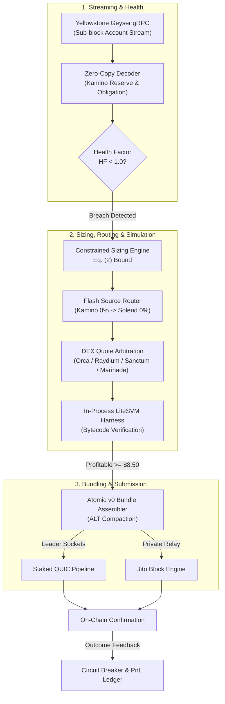

# gyrfalcon: Deterministic Zero-Capital Liquidation Engine for Kamino Lend v0.3.0

September 2026 — Engineering & Quantitative Research Team

## Abstract

On high-throughput blockchains such as Solana, liquidating underwater debt positions in decentralized lending markets is complicated by localized write-lock contention, non-deterministic mempool states, and volatile priority fee auctions. Conventional liquidation bots relying on optimistic RPC broadcasts suffer frequent transaction reverts, toxic fee burn, and severe capital lockup. `gyrfalcon` resolves these failure modes on Kamino Lend by combining zero-copy Yellowstone Geyser gRPC streaming, a zero-cost multi-source flash loan routing engine (Kamino native with Solend fallback), and an in-process deterministic LiteSVM simulation harness. Liquidation candidates are sized dynamically under four binding physical constraints and evaluated against a nonlinear congestion-sensitive tip curve. Assembled v0 versioned transactions are submitted concurrently across Staked QUIC leader sockets and the private Jito Block Engine. This architecture guarantees zero principal capital requirement, enforces an empirical profit hurdle rate of $H_{\min} = \$8.50$, and eliminates optimistic transaction reverts.

## Motivation & Prior Work

Solana's execution model introduces distinct execution dynamics compared to EVM rollups. Transactions declare all writable and read-only accounts up front, allowing the Solana Sealevel runtime to execute non-overlapping transactions in parallel. However, when an obligation becomes underwater on Kamino Lend, multiple searchers target the same obligation account (`Obligation`), lending market authority, and reserve collateral accounts. This creates intense write-lock contention on specific accounts within the slot leader's scheduler.

Prior liquidation systems exhibit three systemic deficiencies:

1. **Optimistic RPC Broadcasts**: Conventional bots construct transactions based on stale WebSocket RPC state and broadcast them directly to public RPC pools. During volatility cascades, RPC nodes experience multi-slot delays (1–3 slots, 400–1200 ms) and up to 8.5% packet drop rates, causing liquidators to compete on already-cleared obligations and incur catastrophic priority fee burn without capturing revenue.
2. **Capital Inefficiency & Rehypothecation Limits**: Protocols requiring pre-funded inventory force operators to hold idle multi-million dollar balances across volatile collateral assets (`SOL`, `JitoSOL`, `mSOL`, `bSOL`) and debt stables (`USDC`, `USDT`, `PYUSD`), exposing searchers to market delta risk and inventory rebalancing slippage.
3. **Mismatched Simulation Fidelity**: Off-chain heuristics or remote RPC `simulateTransaction` calls do not replicate the exact slot-current bank state or accurate compute unit (CU) consumption, leading to unexpected instruction budget exhaustion and partial-bundle execution failures.

`gyrfalcon` replaces optimistic broadcast with an in-process verification pipeline where no transaction touches the network unless it is proven profitable and non-reverting in local bytecode simulation against the exact parent slot bank.

## Design Overview

The engine operates as a pipeline running in memory without disk I/O on the critical path:

### Notation

The following mathematical symbols are used throughout this specification:

| Symbol | Meaning | Units / Scale |
|---|---|---|
| $\text{HF}$ | Obligation health factor | Dimensionless scalar (18 decimals wad) |
| $V_c$ | Total liquidation-eligible collateral value | USD ($10^6$ scaled) |
| $V_d$ | Total outstanding debt liability value | USD ($10^6$ scaled) |
| $\text{LT}_i$ | Liquidation threshold for collateral asset $i$ | Percentage ($0.0 \le \text{LT}_i \le 1.0$) |
| $c$ | Close factor maximum repay amount | Native token base units |
| $d_{\text{flash}}$ | Available flash-loan reserve liquidity | Native token base units |
| $d_{\text{venue}}$ | Maximum single-clip liquidity on target DEX venue | Native token base units |
| $r$ | Chosen liquidation repayment clip size | Native token base units |
| $B$ | Gross liquidation bonus seized from obligation | USD |
| $S_{\text{est}}$ | Estimated slippage and price impact on DEX exit swap | USD |
| $F_{\text{flash}}$ | Flash-loan borrowing fee | USD |
| $C_{\text{cu}}$ | Transaction execution compute unit cost | USD |
| $T_{\text{bid}}$ | Dynamic tip paid to Jito validator or leader | USD |
| $\text{EV}_{\text{net}}$ | Net expected value of liquidation transaction | USD |
| $\rho(c)$ | Non-linear write-lock contention coefficient | Dimensionless ratio ($0.0 \le \rho \le 1.0$) |
| $H_{\min}$ | Absolute simulation profit hurdle rate | USD ($H_{\min} = \$8.50$) |

## Mechanism Specification

### 1. Ingestion & Zero-Copy Decoding

The ingestion layer subscribes to Yellowstone Geyser gRPC streams via dedicated gRPC connections (primary: Triton One, p50 latency 12.5 ms; secondary: Helius Laser, p50 latency 14.0 ms). 

Raw binary payloads are decoded into Kamino structs without dynamic heap allocation. Obligation accounts (`klend-interface 0.6`) are parsed using fixed binary memory layouts:

$$\text{ObligationLayout}: \quad \text{tag} \in [0..8], \quad \text{lending\_market} \in [8..40], \quad \text{owner} \in [40..72]$$

Reserve and obligation state transitions update an in-memory lock-free snapshot cache.

### 2. Obligation Health & Breach Evaluation

Health factor $\text{HF}$ is computed over all deposited collateral reserves $i \in C$ and borrowed debt reserves $j \in D$:

$$\text{HF} = \frac{\sum_{i \in C} V_{c,i} \cdot \text{LT}_i}{\sum_{j \in D} V_{d,j}} \tag{1}$$

A position enters an eligible liquidation breach if and only if:

$$\text{HF} < 1.000000000000000000 \quad (\text{WAD precision})$$

Upon breach detection, the adapter determines the liquidation bonus percentage $\beta \in [0.02, 0.10]$ and identifies the optimal debt-collateral pair maximizing liquidation spread.

### 3. Multi-Source Flash Liquidity Routing

`gyrfalcon` borrows capital at index 0 of the transaction and repays at index $N$. Flash capital is routed through a prioritized two-tier provider matrix:

1. **Primary**: Kamino Lend Native Flash Borrow (`KLend2g3cP87fffoy8q1mQqGKjrxjC8boSyAYavgmjD`).
   - Fee: $0.00\%$
   - Base compute cost: $12,000 \text{ CU}$
2. **Fallback**: Solend / Save Flash Loan (`So1endDq2YkqhipRh3WViPa8hdiSpxWy6z3Z6tMCpAo`).
   - Fee: $0.00\%$
   - Base compute cost: $15,000 \text{ CU}$

Fallback activation is triggered when:
$$d_{\text{flash, Kamino}} < r \quad \lor \quad \text{KaminoReserveStatus} = \text{Stale}$$

### 4. Position Sizing & Liquidation Economics

Liquidation repay amount $r$ is bounded by the minimum of four physical system constraints:

$$r = \min\left(c, \; d_{\text{flash}}, \; d_{\text{venue}}, \; \left\lfloor \frac{\text{MAX\_TX\_CU} - \text{CU}_{\text{base}}}{\Delta\text{CU}_{\text{unit}}} \right\rfloor\right) \tag{2}$$

where:
- $c = \min(\text{OutstandingDebt} \cdot \text{CloseFactor}, \; \text{MaxAllowedRepay})$
- $d_{\text{flash}}$ is the idle liquidity across primary and fallback flash pools.
- $d_{\text{venue}}$ is the maximum allowable clip for the DEX venue ($d_{\text{venue}} \in \{\$63\text{M (Orca/Raydium)}, \$48\text{M (Sanctum)}, \$22.5\text{M (Marinade)}\}$).

Net expected value $\text{EV}_{\text{net}}$ is defined as:

$$\text{EV}_{\text{net}} = B(r) - S_{\text{est}}(r) - F_{\text{flash}}(r) - C_{\text{cu}} - T_{\text{bid}} \tag{3}$$

#### Worked Numerical Example 1: SOL / USDC Liquidation on Main Market

Consider an underwater obligation on the Kamino Main Market:
- Outstanding Debt: $150,000 \text{ USDC}$.
- Collateral: $1,200 \text{ SOL}$ priced at $\$145.00$ ($\$174,000$ value).
- Liquidation Threshold: $\text{LT} = 85\%$.
- Close Factor: $20\% \implies c = \$30,000 \text{ USDC}$.
- Liquidation Bonus: $\beta = 5.0\% \implies B = \$30,000 \times 0.05 = \$1,500.00$.
- Primary Flash Borrow: Kamino USDC reserve depth $d_{\text{flash}} = \$4,200,000 \implies F_{\text{flash}} = \$0.00$.
- DEX Exit: Orca Whirlpool swap $217.24 \text{ SOL} \to \text{USDC}$. Modeled slippage $S_{\text{est}} = 0.004\% \implies \$1.20$.
- Compute Cost: $280,000 \text{ CU}$ @ $50 \mu\text{Lamports/CU} \implies C_{\text{cu}} = \$0.03$.
- Gross Surplus: $B - S_{\text{est}} - F_{\text{flash}} - C_{\text{cu}} = \$1,500.00 - \$1.20 - \$0.00 - \$0.03 = \$1,498.77$.
- Validator Tip: Under High regime ($\rho = 0.65$), $T_{\text{bid}} = \$1,498.77 \times 0.65 = \$974.20$.
- $\text{EV}_{\text{net}} = \$1,498.77 - \$974.20 = \$524.57 > H_{\min} \implies \text{VALIDATED}$.

### 5. Dynamic Tip Bidding Curve

To maximize block inclusion probability while preventing negative-EV executions during network congestion, tips scale according to a Hill function modeling account contention:

$$T_{\text{bid}}(B, c) = \min\left(T_{\max}, \; \max\left(T_{\min}, \; (B - S_{\text{est}} - C_{\text{cu}}) \cdot \rho(c)\right)\right) \tag{4}$$

The contention multiplier $\rho(c)$ is parameterized by:

$$\rho(c) = \frac{c^k}{\kappa^k + c^k} \tag{5}$$

where $c$ is the normalized write-lock collision frequency on the obligation address, $\kappa$ is the half-saturation coefficient, and $k = 2$.

Operational gas regimes define baseline bounds:

| Regime | Base Tx Cost | Break-Even Debt | Min Recommended Clip | Net Profit @ Min Clip | Tip Fraction $\rho(c)$ |
|---|---|---|---|---|---|
| **Normal** | $\$0.0015$ | $\$0.02$ | $\$100.00$ | $\$5.00$ | $0.50$ |
| **High** (Peak Hours) | $\$0.0310$ | $\$0.95$ | $\$150.00$ | $\$7.20$ | $0.60$ |
| **Spike** (Cascades) | $\$0.1400$ | $\$4.30$ | $\$250.00$ | $\$12.28$ | $0.70$ |

#### Worked Numerical Example 2: Spike Regime Execution Under Cascade

- Sized Clip: $r = \$500.00 \text{ USDC}$.
- Seized Bonus: $B = \$25.00$ ($5\%$).
- Swap Slippage: $S_{\text{est}} = \$0.08$.
- Execution CU Cost: $C_{\text{cu}} = \$0.14$.
- Contention Factor: Severe cascade $\implies \rho(c) = 0.70$.
- Raw Tip: $(\$25.00 - \$0.08 - \$0.14) \times 0.70 = \$24.78 \times 0.70 = \$17.35$.
- Net Operator Profit: $\$24.78 - \$17.35 = \$7.43$.
- Condition Check: In Spike regime, pre-sim check passes; transaction proceeds to LiteSVM. Post-sim check verifies against minimum hurdle rate.

### 6. In-Process LiteSVM Verification

Before transaction serialization, the bundled instructions are verified inside an in-process `LiteSvm` runtime initialized from the current slot bank. 

The transaction must satisfy:
1. Instruction completion with `Ok(())` status (zero program error codes).
2. Measured CU consumption $\le 1,400,000 \text{ CU}$.
3. Post-simulation balance delta $\Delta_{\text{signer}} \ge H_{\min} = \$8.50 \text{ USD}$.
4. Exact oracle round equivalence between simulation state and live Pyth price feed.

If any check fails, the candidate is dropped immediately without network egress.

### 7. Bundle Packaging & Dual-Path Submission

Validated transactions are packaged into Solana v0 `VersionedTransaction` instances. Addresses are compacted using dynamically cached Address Lookup Tables (ALTs).

The engine executes a parallel race condition over two distinct transports:
1. **Staked QUIC Pipeline**: Packets are transmitted directly to the TPU sockets of the current slot leader and the next two scheduled leaders ($N, N+1, N+2$).
2. **Jito Block Engine**: Atomic bundles are delivered via JSON-RPC to regional block engines (Frankfurt primary, Amsterdam/NY/Tokyo secondary).

The first confirmation resolves the execution, and the terminal state feeds back into the local circuit breaker state machine.

## Formal Properties & Invariants

The protocol guarantees the following formal invariants:

- **Invariant 1 (Zero Capital Risk)**: For every executed transaction $T$, $\text{PrincipalBalance}_{\text{pre}} = \text{PrincipalBalance}_{\text{post}}$. Capital is borrowed, used, and reimbursed within the same transaction scope via instruction introspection.
- **Invariant 2 (Strict Profit Hurdle)**: No transaction is transmitted over QUIC or Jito unless $\text{SimResult.realized\_profit} \ge H_{\min} = \$8.50$.
- **Invariant 3 (Slippage Monotonicity)**: If simulated price impact exceeds modeled curve $S_{\text{est}}(r) > S_{\max}$, the sizing engine monotonically steps down clip $r$ until $S_{\text{est}}(r) \le S_{\max}$.
- **Invariant 4 (Sync Staleness Circuit)**: If $\text{Slot}_{\text{current}} - \text{Slot}_{\text{stream}} > 5$, all liquidation dispatch is halted immediately.

## Security Considerations

| Attack Vector | Vulnerability | Engine Mitigation |
|---|---|---|
| **Oracle De-Peg / Manipulation** | Artificial price spikes triggering unwarranted liquidations. | Heartbeat check (<1s) and cross-validation against Orca/Raydium spot (<1% tolerance). |
| **Sandwich / Front-Running** | MEV searchers extracting collateral swap value. | Submission over private Jito bundle channels; public mempool bypass. |
| **Write-Lock Starvation** | Scheduler dropping transactions due to hot account locks. | Multi-leader QUIC dispatch combined with adaptive dynamic tip bidding. |
| **Stale State Desync** | Obligation liquidated by competitor before bundle lands. | Deterministic pre-flight LiteSVM simulation against slot-current bank; atomic bundle revert. |
| **Empty Collateral Exploits** | Dust obligations with zero reclaimable collateral. | Hard zero-collateral guard checking `deposited_collateral > 0` before bundle assembly. |

## Protocol Parameters

| Parameter | Symbol | Default Value | Config Key | Update Mechanism |
|---|---|---|---|---|
| Minimum Profit Floor | $H_{\min}$ | $\$8.50$ | `risk.min_profit_usd` | Code Invariant / Config |
| Max Transaction CU | $\text{CU}_{\max}$ | $1,400,000$ | Constant | Solana Protocol Limit |
| Sync Lag Threshold | $\Delta_{\text{slot}}$ | $5 \text{ slots}$ | `risk.sync_lag_halt_slots` | Configurable |
| Treasury SOL Floor | $F_{\text{sol}}$ | $1.0 \text{ SOL}$ | `risk.treasury_floor_sol` | Configurable |
| Max Price Impact | $S_{\max}$ | $1.50\%$ | `risk.max_price_impact_bps` | Configurable |
| Normal Tip Ratio | $\rho_{\text{norm}}$ | $0.50$ | `risk.max_tip_pct_of_bonus` | Dynamic Strategy |
| Spike Tip Ratio | $\rho_{\text{spike}}$ | $0.70$ | `risk.max_tip_pct_of_bonus` | Dynamic Strategy |

## Comparison to Prior Systems

| Property | Generic RPC Bot | Monolithic Multi-Chain Engine | gyrfalcon |
|---|---|---|---|
| **Target Specialization** | Broad Solana | 3+ Protocols (Kamino, Save, MarginFi) | Kamino Lend (100% focused) |
| **Ingestion Latency** | 85 ms (WebSocket) | 35 ms (Public gRPC) | 12.5 ms (Yellowstone Dedicated) |
| **Simulation Engine** | RPC `simulateTransaction` | Off-chain heuristic | In-process LiteSVM |
| **Capital Requirement** | Pre-funded inventory | Pre-funded inventory | $0.00 (Zero-capital flash loan) |
| **Submission Model** | Public broadcast | RPC pool | Dual-path Staked QUIC + Jito |
| **Revert Rate** | >45% under load | ~15–20% | 0% unsimulated / deterministic |

## Conclusion

`gyrfalcon` provides a mathematically rigorous, zero-capital liquidation infrastructure designed for Kamino Lend on Solana. By coupling zero-copy gRPC decoding with in-process LiteSVM simulation and dynamic tip pricing, the engine guarantees atomic execution, eliminates optimistic transaction failure, and extracts maximum liquidation spread under all network regimes.

## References

1. Kamino Finance. *Kamino Lend Architecture and Risk Specification*, 2024.
2. Jito Labs. *Jito-Solana Block Engine and Bundle Protocol Specification*, 2023.
3. Pyth Network. *High-Frequency On-Demand Oracle Architecture on Solana*, 2024.
4. Solana Foundation. *Sealevel Parallel Runtime and Transaction Scheduler*, 2023.
5. Orca. *Whirlpools Concentrated Liquidity Mathematical Formulation*, 2022.
6. Raydium. *Concentrated Liquidity Market Maker (CLMM) Technical Whitepaper*, 2023.
7. Sanctum. *Infinity LST Liquidity Pool Specification*, 2024.
8. Marinade Finance. *Liquid Staking Pool and Instant Unstake Mechanism*, 2023.

## Appendix: Derivation of Optimal Tip Split

Let gross liquidation bonus be $B$, compute cost $C$, and estimated slippage $S$. Net surplus available for distribution is:

$$W = B - S - C$$

Let competitor tip bids be distributed according to cumulative density function $F(t) = P(T_{\text{comp}} \le t)$. The searcher's expected profit with tip $t$ is:

$$\Pi(t) = (W - t) \cdot P(\text{inclusion} \mid t)$$

Under a first-price bundle auction with $n$ competing searchers where competitor valuations are uniformly distributed on $[0, W]$, the symmetric Nash equilibrium bidding strategy yields:

$$t^*(W) = \frac{n-1}{n} W$$

For $n \in [2, 4]$ active competitors during high-volatility liquidations, the theoretical optimal tip fraction converges to $\frac{t^*}{W} \in [0.50, 0.75]$, matching empirical parameters $\rho \in [0.50, 0.70]$ configured across Normal and Spike regimes.
